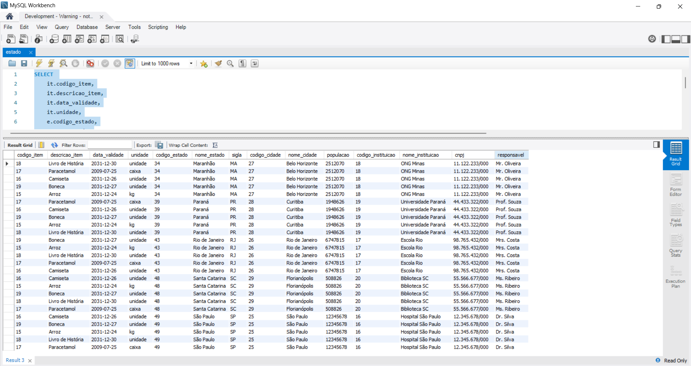
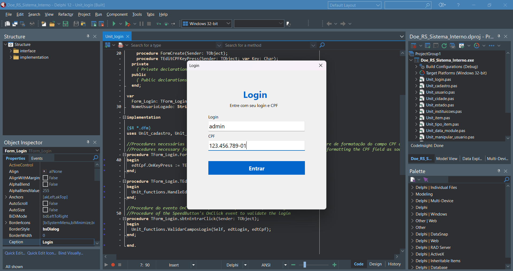
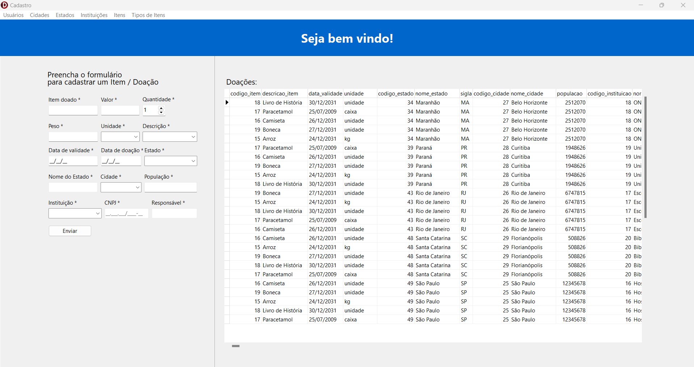
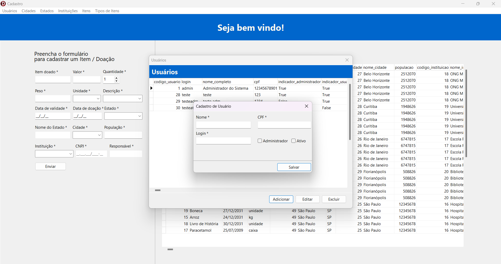
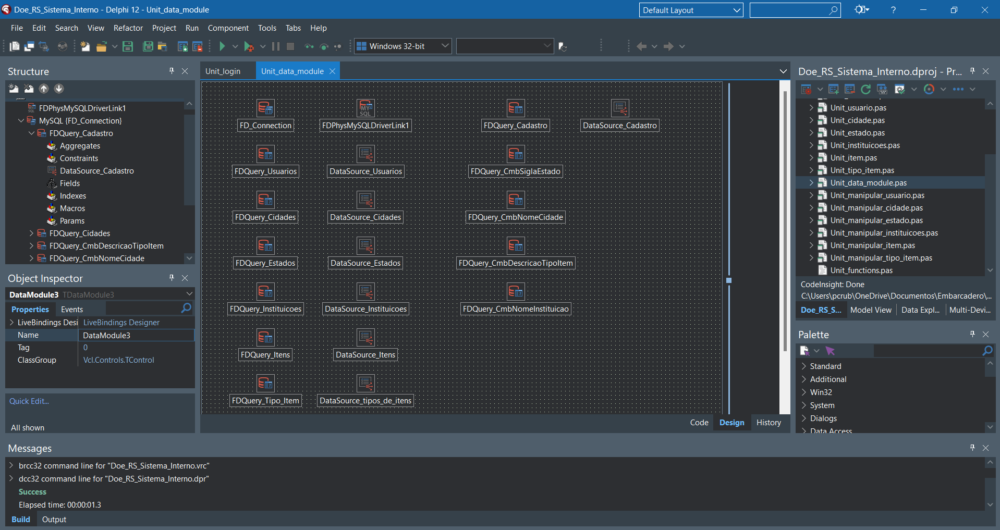

# Delphi DoeRS_InternalManagement

Este é um sistema interno desenvolvido em Object Pascal utilizando a IDE Delphi Athen 12. O objetivo do sistema é realizar o controle e gerenciamento de medidas emergenciais para o colapso climático ocorrido em maio de 2024 no Estado do Rio Grande do Sul. É um sistema de uso interno para uma organização sem fins lucrativos, com o propósito de gerenciar ações de controle e planejamento relacionadas ao tema.

 

## 🎯 Funcionalidades
> Login, Segurança e Controle de Acesso  
> Formulário de Cadastro de doações, cruds e grids  
> Persistência de dados no Data Module e unit exclusiva para Functions e Procedures  
> Validação e obrigatoriedade de campos  
> Código Comentado em duas linguas, português e inglês, a fim de fomentar e contribuir com a comunidade

 

## 💻Sobre o Sistema:
- **Banco de Dados MySQL**: Uso de banco de dados relacional MySQL para cadastro completo das seguintes colunas: Usuário, Cidade, Estado, Instituição, Item, Tipo de Item, Doação, Item Doação.

 

- **Login, Segurança e Controle de Acesso**: Sistema de login com controle de acesso, permitindo que apenas usuários administradores tenham acesso a certas funcionalidades, e apenas usuários ativos consigam logar.

 

- **Formulário de Cadastro**: Tela de cadastro de doações, é a primeira tela após o login, nela é possível cadastrar apenas a doação em si, é necessário alguns dados de outras tabelas nas quais o usuário sem permissão de adm não tem permissão de acessar nem inserir ele mesmo, por isso, alguns campos são necessários para que seja possível puxar alguns dados por consultas no banco que preenchem os selects do combobox, com isso é possível preencher alguns TEdits ocultos e com isso ter todos os dados necessários para dar o Insert da doação no banco

 

- **Cruds e Grids**: Cruds e Grids para manipulação e visualização de todas as tabelas do banco, sendo que somente o usuário adm pode ter acesso ao menu que leva a todos os cruds e grids

- **Persistência de dados no Data Module**: Todos os componentes de conexão, querys e data sources concentrados dentro do data module

- **Unit exclusiva para Functions e Procedures**: A maior parte das procedures e functions estão concentradas nessa Unit exclusiva para isso, e a maioria das functions e procedures que não estão ai são eventos dos próprios formulários as quais elas pertencem

- **Validação e obrigatoriedade de campos**: Todos os campos do sistema tem suas próprias validações, tratativas e obrigatoriedade

- **Código Comentado em duas linguas**: Comentários explicativos em todas as functions, presentes em todas as Units tanto em Português quanto em Inglês a fim de fomentar e contribuir com a comunidade.
